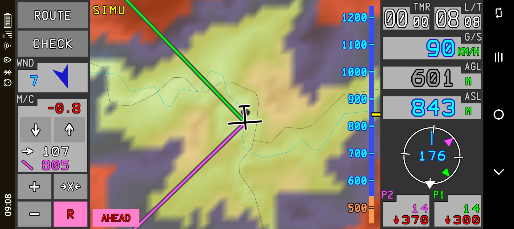

# G-NAV 

G-NAV is an electronic flight instrument system (EFIS) for soaring that runs as a progressive web application (PWA) in most mobile web browsers (Chrome, Safari and others).
The application can be installed locally in the client browser and it starts up and runs offline like a native app.

G-NAV is almost entirely written in Ada and it is compiled to [WASM](https://webassembly.org/) through [AdaWebPack](https://github.com/godunko/adawebpack). Furthermore, G-NAV fully relies on [WebGL](https://www.khronos.org/webgl/) for graphics.

Visit the project [website](https://go-gliding.app) for demo servers and more infomation.

There is also a native version of the software that you can find [here](https://github.com/GuillermoHazebrouck/gnav). The applications are quite similar, although there will be more and more discrepancies as this project evolves.

## Operation
G-NAV provides navigation functions, real time data feed and awareness alerts.

To operate G-NAV, please read the user's manual located in the `docs` folder. This document covers the user functions and the web system administration. Be aware that the project is still under development.

> [!CAUTION]
> G-NAV is not a certified IFR equipment! You should never use this device as a primary source of navigation or collision avoidance.

## System architecture
This web version of G-NAV consist of a client application that makes HTTP requests to a specialized server. The server has access to the necessary static files (terrain, airspaces, references, etc.) and it also connects to different online data sources to provide real time traffic and meteo information.

For the traffic data, the server is able to connect to the OGN APRS servers via TCP, parse the text messages on the fly and feed an internal stack. This information residing in main memory is then used to generate a highly compressed and customized response for each client, containing only tracks around the provided location. If the follow function is activated, then the server records the provided location in an IGC file that can be retrieved afterwards using the assigned squawk code.

For the meteo data, the server can be configured to obtain metar messages from different stations via HTTP requests. The server automatically checks for updates and periodically generates a compressed response for the clients. The client then dynamically selects the closest station during the flight and can automatically feed the current wind and QNH values.

## Structure of the repository
This repository is divided in two main folders:
- `gnav-client`: this folder contains the source code for the WASM module in the `src` folder. To compile the project, you need to add a version of the AdaWebPack toolchain in the `awp` folder. This can be release 22.1 or 22.0. Then you simply run `gprbuild gnav.gpr`.
- `gnav-server`: this folder contains the source code of the server in `src`, the data compiler in `src/crunch` and the server backbone structure in `server`. To compile the project, you need to add a version of the Ada Web Server in the `aws` folder. We provide here a bare bone version containing the minimum features necessary for this project, but you can add a more sophisticated version if you want. You will need to have the gnatcoll development library installed in any case. Then you simply run `gprbuild gnav_server.gpr` for the server and `gprbuild crunch.gpr` for the data compiler.

You can use the `gnav-server/server` folder for testing the server during development. When you compile the different projects, the excecutables are copied into the right folder.

Note that there are README pages on the most important folders.

> [!NOTE]
> You will find a modified version of `adawebpack.mjs`, which is temporarily necessary to include new features and overcome issues.

## Releases
Keep an eye on the [releases](https://github.com/GuillermoHazebrouck/gnav-web/releases), there will be precompiled versions in the future.
The provision of data is not part of the project yet, you will need to collect your own dataset to build a functional system. We only provide here minimal example datasets and the tools to generate the necessary data feed.

## Credits
This software is made possible thanks to:
- Guillermo Hazebrouck for everything in this repo (G-NAV)
- Vadim Godunko and Maxim Reznik for [AdaWebPack](https://github.com/godunko/adawebpack)
- The Ada FSF community
